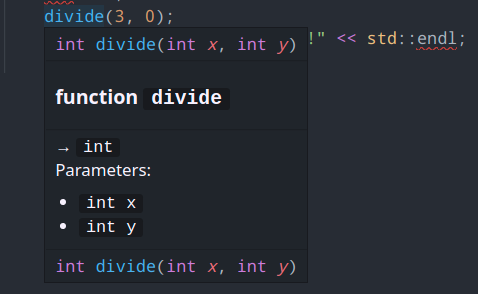
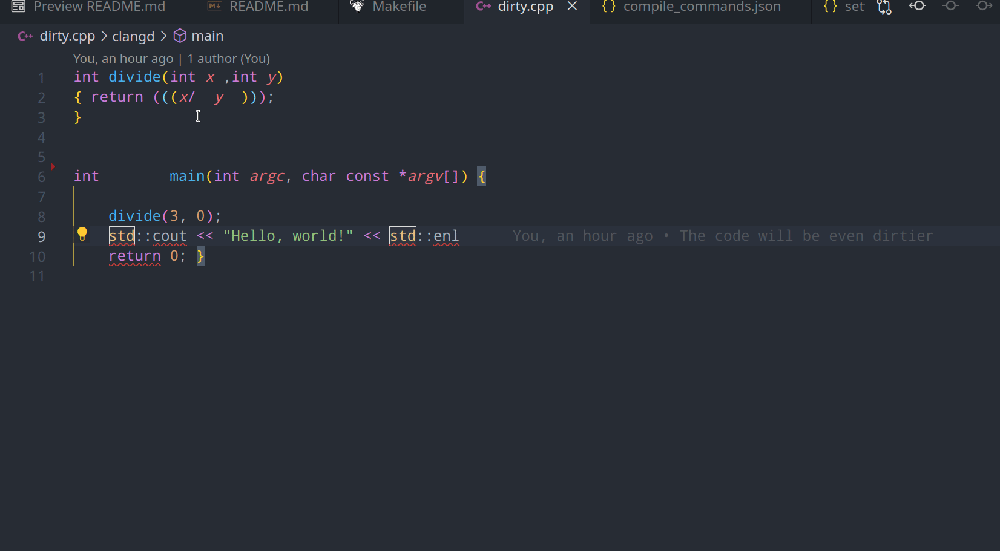
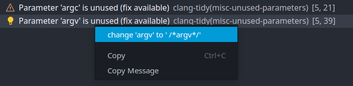

# Workshop clang tools

*Ce workshop traite sur l'intégration des outils clang dans vscode. Il peut aussi vous aider à vous familiariser avec les outils qu'offrent la suite clang si vous utilisez des IDE's inférieurs.*

**N'hésitez pas à star ⭐ le repo si vous avez aimé ce workshop!**

Déroulement du workshop:
 - Installation des outils nécessaires
 - Mise en place de sa propre norme à l'aide de clang-format
 - Mise en place du language server clangd avec vscode.
 - Utilisation du language server, lint et clang-tidy
 - Mise en place d'un CI pour vérifier que son code compile

## 0 : Mise en place du workshop en local

```sh
git clone git@github.com:ajnart/workshop-llvm.git workshop
cd workshop
```

 ## 1 : Installation des outils nécessaires
 ### Installation CLANGD
 Tout d'abord nous allons installer clangd, à l'aide de la page [d'installation](https://clangd.llvm.org/installation.html)

*Vous pouvez vérifier l'installation à l'aide de ``clangd --version``*

 Ainsi que l'extesion vscode [clangd](https://marketplace.visualstudio.com/items?itemName=llvm-vs-code-extensions.vscode-clangd)
 à l'aide de la commande *(ctrl+p)*:
 
 ``ext install llvm-vs-code-extensions vscode-clangd``

### Installation CLANG-FORMAT
Clang-format devrait être installé depuis le paquet installé dans l'étape précédente, pour le vérifier, faites: ``clang-format --version``

### Installation CLANG-TIDY
Clang-format devait également être installé.
On vérifie ça grâce à: ``clang-tidy --version``

### Installation de Bear
Nous allons également installer [B-ear](https://github.com/rizsotto/Bear) afin de générer une base de donnée de compiliation de nos projets. Bear créera un ``compile_commands.json`` qui permettera à clangd de mieux linter votre code.


### Recommendations
L'extension clangd recommande de désinstaller l'extension C/C++ pour ne pas avoir de duplications de recommendations

## Mise en place de sa propre norme grâce à Clang-Format
### Configuration de la norme
Dans cette étape, nous allons générer un fichier .clang-format qui vas être utilisé pour dire à ``clang-format`` quelle norme utiliser pour linter vos fichiers.

Pour ce faire, utilisez un [générateur en ligne](https://zed0.co.uk/clang-format-configurator/)

Sauvegardez votre .clang-format dans le dossier de ce workshop.

Clang-format va chercher le fichier .clang-format le plus proche du current working directory en remontant recursivement dans vos fichiers.

### Installation de la norme

Maintenant, faites en sorte que l'extension clangd soit le formatteur de code par défaut dans vscode:

> *ctrl+p format document with...*

> 

on alors en éditant son fichier *settings.json*:

```json
"[cpp]": {
        "editor.defaultFormatter": "llvm-vs-code-extensions.vscode-clangd"
    },
```
Vous devriez maintenant être en mesure de formatter votre code à l'aide de votre config .clang-format

## Mise en place du language server Clangd

### Vérification du fonctionnement de clangd

⚠  **Il faut faire la commande `bear -- \build command\` pour créer la base de donnée de compilation pour clangd**.
Dans notre example : ``bear -- make`` générera un fichier ``compile_commands.json`` qui sera ensuie utilisé pour linter vos fichiers.

En mettant votre curseur sur la fonction divide, clangd devrait vous montrer le prototype de la fonction
> 

## Clang-tidy
### Mise en place de clang-tidy
Nous allons maintenant configurer clang-tidy pour avoir des recommendations sur notre code.

Créer un fichier ``.clang-tidy``

```yaml
Checks: "
    *,
    -fuchsia*,
"
```

Cette configuration active tout les checks par défaut, il faut ensutie désactiver manuellement certains checks à la main en rajoutant une ligne sous la forme:  ``-\glob\,``

Pour voir tout les checks disponnibles, rendez vous [ici](https://clang.llvm.org/extra/clang-tidy/checks/list.html)

### Fix des erreurs de base grâce à l'extension clangd

Comme vous pouvez le voir sur le gif ci-dessous, grâce à clangd il est très facile de régler les erreurs basiques dans votre code :

> 

En fonction de votre configuration clang-tidyn vous aurez des recommendations affichées dans l'onglet *problems* en bas de la fenêtre vscode:

> 

